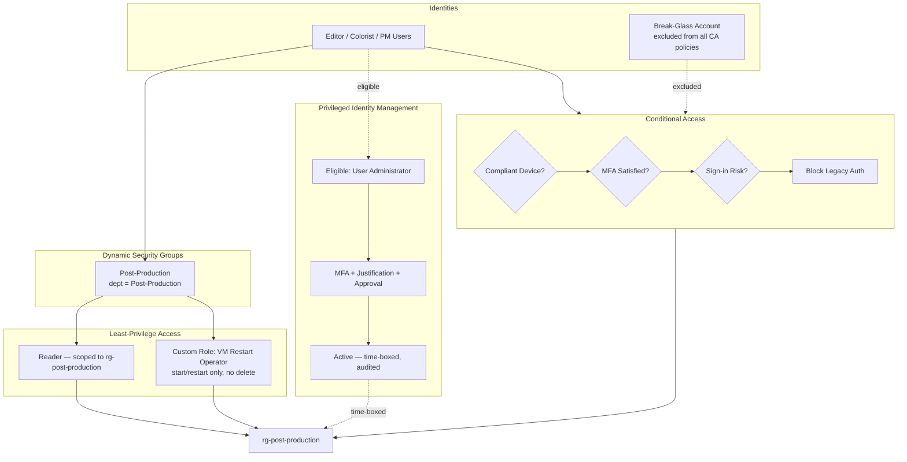

# Architecture — Zero Trust Identity Lab

**The story:** no identity has standing access to anything it doesn't need daily. Access is either tightly scoped by RBAC, gated by Conditional Access signals, or time-boxed through PIM — and the one account that bypasses all of it (break-glass) is isolated and monitored instead.

> Note: the "Post-Production" department and roles (Editor / Colorist / Project Manager) used throughout this lab are a placeholder scenario borrowed from the book this template is based on — swap in whatever fictional (or real, anonymized) org/department makes sense to you. What matters for the portfolio is the pattern: attribute-driven dynamic groups → scoped RBAC → Conditional Access → PIM.
