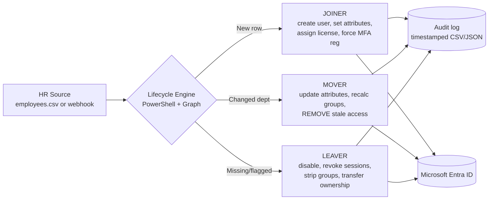

# Architecture — Automated Identity Lifecycle Pipeline

**Why the HR source is external:** real pipelines read from Workday, SuccessFactors, or an HR database. The mock CSV here is architecturally identical — a source of truth external to the identity system that drives every change. Never let the identity system itself be the source of truth for who works there; that's the design flaw that creates orphaned accounts.
