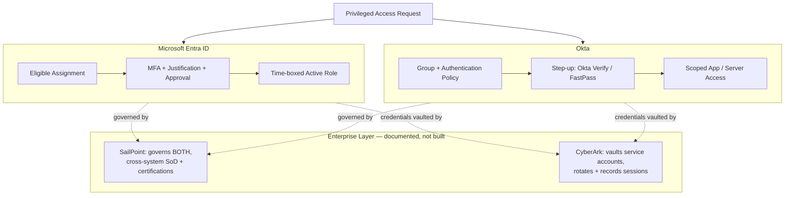

# Architecture — Multi-Platform PAM Comparison

**The mechanism difference, precisely:** Entra ID PIM time-boxes a **role assignment** — the permission itself is temporary and disappears on expiry. Okta's Authentication Policy gates the **session** — the group membership (and thus permission) is permanent, but reaching the protected resource requires satisfying a stronger factor at authentication time. Both reduce risk from stolen credentials; only PIM eliminates the standing permission.
