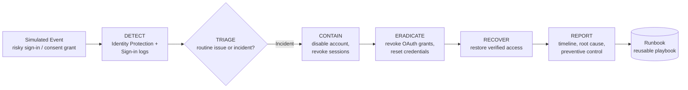

# Architecture — Incident Response Simulation

```mermaid
flowchart LR
    SIM[Simulated Event<br/>risky sign-in / consent grant] --> DET[DETECT<br/>Identity Protection +<br/>Sign-in logs]
    DET --> TRI{TRIAGE<br/>routine issue or incident?}
    TRI -->|Incident| CON[CONTAIN<br/>disable account,<br/>revoke sessions]
    CON --> ERA[ERADICATE<br/>revoke OAuth grants,<br/>reset credentials]
    ERA --> REC[RECOVER<br/>restore verified access]
    REC --> REP[REPORT<br/>timeline, root cause,<br/>preventive control]
    REP --> RUN[(Runbook<br/>reusable playbook)]
```
